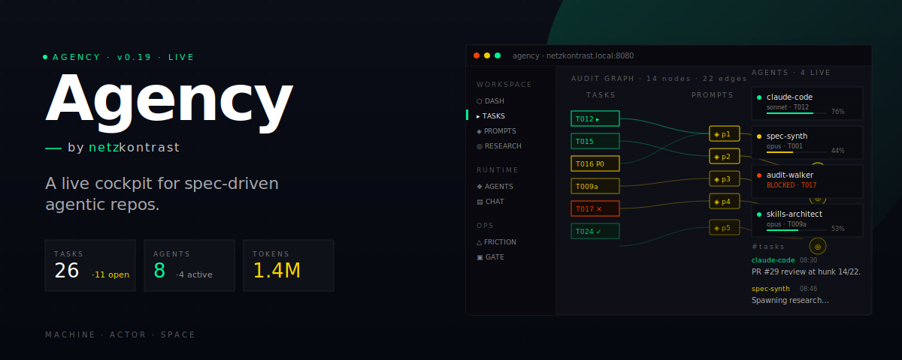

# Agency Frontend



Static, single-page prototype frontend for the agency repo — terminal/brutalist aesthetic
over the existing task / prompt / research / friction-log / pre-commit ontology, plus an
agents panel and Slack-style chat surface.

## Files

| File                | Purpose                                                                  |
| ------------------- | ------------------------------------------------------------------------ |
| `index.html`        | Root SPA. React + Babel inline. No build step.                           |
| `agency-data.js`    | Snapshot of repo data: tasks, prompts, research, friction logs, runs,    |
|                     | agents, channels, messages. Edit this to keep the prototype in sync.     |
| `tweaks-panel.jsx`  | In-page Tweaks shell (used when running inside the host harness).        |

## Run locally

```bash
cd frontend
python3 -m http.server 8080
# → http://localhost:8080
```

Any static file server works — no Node, no bundler.

## Views

- **Dashboard** — counts, active tasks, friction histogram
- **Tasks / Prompts / Research** — list + detail with cross-links
- **Audit Graph** — full task↔prompt↔research lattice
- **LLM-Wiki** — schema-aware filterable graph + entity browser
- **Friction Log** — FL0–FL3 entries w/ token profile per run
- **Pre-commit** — run history + governance gate terminal output
- **Agents** *(new)* — live agent panel: model, status, current task, token budget
- **Chat** *(new)* — Slack-style channels + DMs with agent threading
- **Settings** — display, governance, token budget, identity

## Keyboard

- `⌘K` / `Ctrl+K` — command palette (fuzzy across all entities)
- `Esc` — close palette

## Wiring to live data

`agency-data.js` is shaped to mirror the repo frontmatter ontology one-for-one.
To wire to real data, replace it with a generator that walks `/tasks/`, `/prompts/`,
`/research/`, `/friction-logs/`, `/precommit/runs/` and emits the same shape onto
`window.AGENCY_DATA`.

The `agents` and `messages` blocks are illustrative — replace with whatever stream
the runtime exposes (e.g. tail of an `agents.jsonl` + a `chat.jsonl`).
